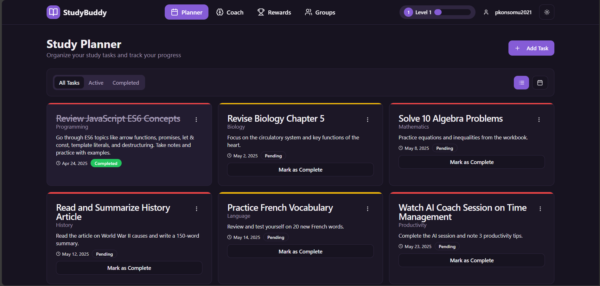

# AI_StudyBuddy 🤖📚 - Smart Homework Organizer



StudyBuddy is your intelligent, gamified academic planner built for the modern student. It organizes assignments, plans your study sessions, and motivates you with personalized AI coaching and collaborative tools. StudyBuddy turns the often overwhelming academic grind into a smart, fun, and productive experience.

This tool is ideal for:

- Students who are behind their schedule and tasks
- Educators building smarter learning environments
- Self-learners who need a responsive and adaptive assistant

## Features

- 🧠 **AI Chat Companion / Study Coach**  
  Get intelligent study advice tailored to your schedule, priorities, and difficulty levels.

- 📅 **Google Calendar Integration**  
  Automatically import deadlines and events.

- 🎮 **Gamified Productivity**  
  Earn XP, maintain streaks, and unlock rewards as you study.

- 🌙 **Dark Mode**  
  For those productive late-night sessions.

- 👥 **Collaborative Study Planner**  
  Create or join study circles, assign tasks, and track accountability together.

- 💡 **AI-Powered Micro-Plans**  
  Generate bite-sized sessions from complex tasks for better focus and retention.

- 🔔 **Smart Reminders & Motivation**  
  Friendly nudges and customizable motivational quotes to keep you going.


## 🧠 Implementation Strategy

### ✅ 1. Gamified Productivity

- **Points System**: Earn points based on task difficulty or time.
- **Streak Tracker**: Encourages daily learning with a reset upon a missed day.
- **Unlockables**: Themes and avatars unlock at XP thresholds.

### ✅ 2. AI Chat Companion / Study Coach

- GPT-4 Turbo integration with context-aware prompts.
- Smart prioritization (e.g. “I have 2 hours and 3 tasks…”).
- Session breakdowns based on due date, difficulty, and subject.
- Reminder engine with friendly messages and motivational boosts.

### ✅ 3. Collaborative Study Planner

- **Groups / Circles**: Users join or create study groups.
- **Shared Tasks + Roles**: Assign responsibilities and receive deadlines.
- **Accountability Tracker**: View group member progress and nudge when needed.

## 🧩 How It All Works Together

- A student joins a group and logs in daily.

- Completing tasks earns points and boosts streaks.

- AI suggests study priorities and micro-tasks.

- Study circles add a layer of accountability and support.

- All features combined = smart, social, and stress-free study.

## Tech Stack

- **Frontend**
  - React.js (with TypeScript)
  - Tailwind CSS for styling
  - Lucide React for icons
  - React Hot Toast for notifications

- **Backend**
  - Node.js
  - Express.js
  - MySQL

- **APIs**
  - OpenAI GPT-4 API

## Getting Started

1. **Prerequisites**
   - Node.js >= 14
   - MySQL Server
   - OpenAI API Key

2. **Environment Setup**
   ```bash
   # Clone the repository
   git clone <repository-url>
   cd studybuddy

   # Install dependencies
   npm install

   # Set up environment variables
   ```

3. **Development**
   ```bash
   # Start the development server
   npm run dev
   ```

4. **Build**
   ```bash
   # Create production build
   npm run build
   ```

## Authentication

The application uses Supabase Authentication with email/password sign-in. Users can:
- Create new accounts
- Sign in to existing accounts
- Sign out
- Access their personal assignments and study data

## License

This project is licensed under the MIT License - see the LICENSE file for details.